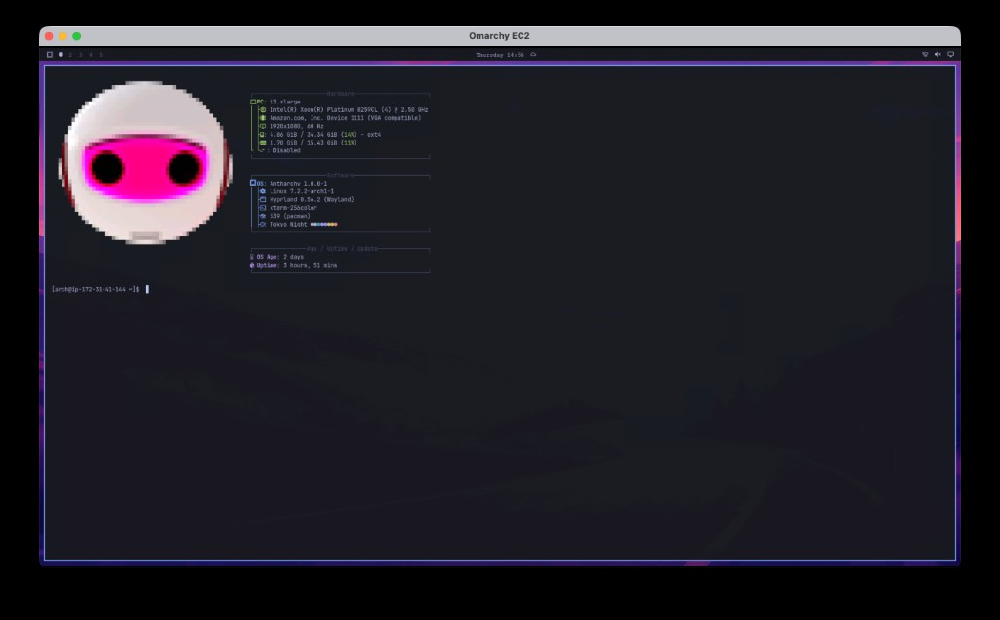

# Antharchy ⚡

**Antharchy** is a beautiful, modern & agentic Arch Linux desktop distribution by [Anthus AI](https://github.com/AnthusAI), built for AI-assisted engineering and cloud development.




Based on [Hyprland](https://hyprland.org/), [UWSM](https://github.com/Vladimir-csp/uwsm), and customized for high-efficiency development workflows with Anthropic Claude, Claude Code, and modern tooling.

---

## Highlights

- **Modern Wayland Tiling Desktop**: Fast, fluid animations and dynamic tiling powered by Hyprland.
- **AI-First Developer Stack**: Out-of-the-box integration with Claude, Anthropic developer tools, and agentic workflows.
- **Cleaned & Curated Software**: Stripped of proprietary non-dev bloat (no Basecamp, no HEY).
- **Cute Bot Avatar**: High-resolution 24-bit TrueColor Unicode terminal branding with true spherical proportions.
- **Cloud & EC2 Ready**: Runs headlessly on AWS EC2 instances with zero physical display or GPU needed, streaming over WayVNC and Moonlight/Sunshine.
- **Command Center**: Unified `antharchy` CLI suite for system updates, themes, and configuration.

---

## Installation on Arch Linux / AWS EC2

Add the Antharchy repository to your `/etc/pacman.conf`:

```ini
[antharchy]
SigLevel = Optional TrustAll
Server = https://github.com/AnthusAI/Antharchy/releases/download/latest/$arch
```

Then install:
```bash
sudo pacman -Sy antharchy antharchy-settings
```

---

## Running locally on Apple Silicon

Antharchy is a Linux desktop, not a macOS app. On an Apple Silicon Mac it runs in a Lima VM: Arch Linux ARM, Hyprland on virtio-gpu, this git tree mounted at `/antharchy`.

```bash
brew install lima qemu
limactl start --yes --name antharchy lima/antharchy.yaml
open vnc://127.0.0.1:5901   # QEMU display (password in ~/.lima/antharchy/vncpassword)
open vnc://127.0.0.1:5902   # WayVNC of the Hyprland session
```

macOS Screen Sharing keeps Command for itself, so it never reaches Hyprland. In this VM **Option is Super** (`altwin:swap_lalt_lwin`):

- Option+Space — Omarchy menu (then About for the bot avatar)
- Option+Return — terminal
- Option+K — keybindings cheatsheet

Reconnect to `vnc://127.0.0.1:5902` (the Hyprland session). The QEMU display on 5901 is the same desktop; use whichever client actually sends Option through.

**Super+K** is the keybindings cheatsheet. **Super+Space** (Option+Space) is the Omarchy menu.

The official Omarchy ISO and `pkgs.omarchy.org` are x86_64-only. This local VM is aarch64 and uses Arch Linux ARM packages plus the mounted checkout.

## Running in AWS EC2

Antharchy natively supports headless EC2 execution using virtual KMS and software rendering:

```bash
# Start the session
~/run-hyprland.sh
```

Connect via your Mac:
```bash
open vnc://<EC2-PUBLIC-IP>:5900
```

---

## License

MIT License. Forked from [Omarchy](https://github.com/basecamp/omarchy).
