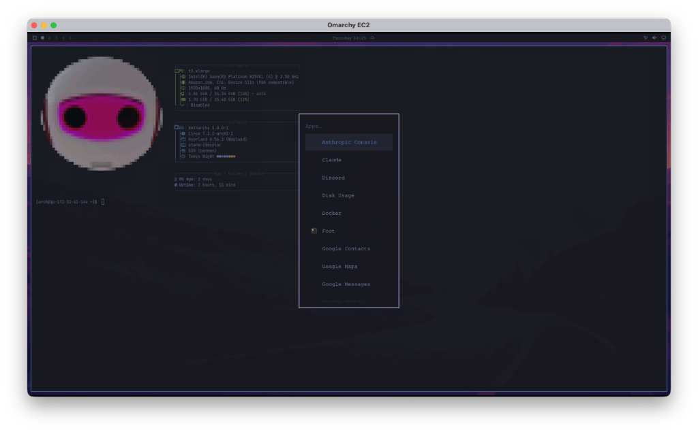

# Antharchy ⚡

**Antharchy** is a beautiful, modern & agentic Arch Linux desktop distribution by [Anthus AI](https://github.com/AnthusAI), built for AI-assisted engineering and cloud development.



Based on [Hyprland](https://hyprland.org/), [UWSM](https://github.com/Vladimir-csp/uwsm), and customized for high-efficiency development workflows with Anthropic Claude, Claude Code, and modern tooling.

---

## Highlights

- **Modern Wayland Tiling Desktop**: Fast, fluid animations and dynamic tiling powered by Hyprland.
- **AI-First Developer Stack**: Out-of-the-box integration with Claude, Anthropic developer tools, and agentic workflows.
- **Cleaned & Curated Software**: Stripped of proprietary non-dev bloat (no Basecamp, no HEY).
- **Cute Bot Avatar**: High-resolution 24-bit TrueColor Unicode terminal branding with true spherical proportions.
- **Cloud & EC2 Ready**: Runs headlessly on AWS EC2 instances with zero physical display or GPU needed, streaming over WayVNC and Moonlight/Sunshine.
- **Command Center**: Unified `antharchy` CLI suite for system updates, themes, and configuration.

---

## Installation on Arch Linux / AWS EC2

Add the Antharchy repository to your `/etc/pacman.conf`:

```ini
[antharchy]
SigLevel = Optional TrustAll
Server = https://github.com/AnthusAI/Antharchy/releases/download/latest/$arch
```

Then install:
```bash
sudo pacman -Sy antharchy antharchy-settings
```

---

## Running in AWS EC2

Antharchy natively supports headless EC2 execution using virtual KMS and software rendering:

```bash
# Start the session
~/run-hyprland.sh
```

Connect via your Mac:
```bash
open vnc://<EC2-PUBLIC-IP>:5900
```

---

## License

MIT License. Forked from [Omarchy](https://github.com/basecamp/omarchy).
